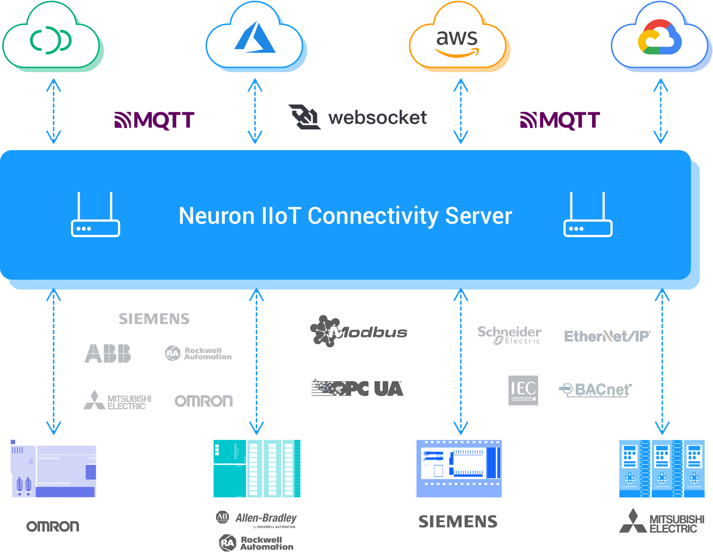

# Neuron

[](https://github.com/neugates/neuron/releases)
[](https://slack-invite.emqx.io/)
[](https://discord.gg/xYGf3fQnES)
[](https://twitter.com/EMQTech)
[](https://www.youtube.com/channel/UC5FjR77ErAxvZENEWzQaO5Q)

[English](https://github.com/neugates/neuron/blob/main/README.md) | 简体中文

Neuron 是一款工业物联网 (IIoT) 连接服务器，用于现代大数据和 AI/ML 技术，以利用工业 4.0 的力量。支持一站式接入数十种工业协议，并将其转换为MQTT协议，实现工业物联网平台与各种工业设备的互联互通。



以下是 Neuron 的一些重要特性：

- 具有实时能力的边缘原生应用程序可以利用边缘端的低延迟网络。
- 松耦合模块化 [架构设计](https://neugates.io/docs/en/latest/architecture.html) 通过可插拔模块扩展更多功能服务。
- 支持可以在运行时更新设备和应用程序模块的热插件。
- 支持多种工业设备协议，包括 Modbus、OPCUA、Ethernet/IP、IEC104、BACnet 等 [更多协议](https://neugates.io/docs/en/latest/module-plugins/module-list.html)。
- 支持同时连接大量不同协议的工业设备。
- 结合[eKuiper](https://www.lfedge.org/projects/ekuiper)提供的规则引擎功能，快速实现基于规则的设备控制或 AI/ML 分析。
- 通过 [SparkplugB](https://neugates.io/docs/en/latest/use_cases.html) 解决方案支持对工业应用程序的数据访问，例如 MES 或 ERP、SCADA、historian 和数据分析软件。
- 具有非常低的内存占用，小于 10M 的内存占用和 CPU 使用率，可以在 ARM、x86 和 RISC-V 等资源有限的硬件上运行。
- 支持在本地安装可执行文件或部署在容器化环境中。
- 控制工业设备，通过[API](https://neugates.io/docs/en/latest/api.html)和[MQTT](https://neugates.io/docs/en/latest/mqtt.html) 服务更改参数和数据标签。
- 与其他 EMQ 产品高度集成，包括 EMQX、NanoMQ、eKuiper。
- 核心框架和 Modbus、MQTT 和 eKuiper 的代码在 LGPLv3 的许可下开源。商业模块需要 [EMQ 许可证](https://neugates.io/docs/en/latest/getting-started/license_policy.html) 才能运行。

欲了解更多信息，请访问我们的[主页](https://neugates.io)。

## 前提条件

[安装所需依赖项](https://github.com/neugates/neuron/blob/main/Install-dependencies.md)

## 编译

```shell
$ git clone https://github.com/emqx/neuron
$ cd neuron
$ git submodule update --init
$ mkdir build && cd build
$ cmake .. && make
```

## 快速开始

```shell
$ cd build
$ ./neuron
```

## 单元测试

运行所有的单元测试

```shell
$ cd build
$ ctest --output-on-failure
```

## 功能测试

运行所有的功能测试

```shell

$ mosquitto -v &
$ pip3 install -r ft/requirements.txt
$ python3 -m robot -P ft/ --variable neuron_api:http -d ft/http_reports ft

```

## 压力测试

在目录`ft/data/persistence/`中有压力测试的数据集。

运行压力测试

```shell
# 安装依赖
$ pip3 install -r ft/requirements.txt

# 使用http接口在数据集total-10k上进行测试
$ python3 -m robot -P ft/ --variable neuron_api:http --variable dataset:total-10k -d ft/http-total-10k ft/pressure.test
# 使用http接口在数据集total-50k上进行测试
$ python3 -m robot -P ft/ --variable neuron_api:http --variable dataset:total-50k -d ft/http-total-50k ft/pressure.test

# 如果使用mqtt接口则需要MQTT服务器，此例为mosquitto
$ mosquitto -v &

# 使用mqtt接口在数据集simple-1k上进行测试
$ python3 -m robot -P ft/ --variable neuron_api:mqtt --variable dataset:simple-1k -d ft/mqtt-simple-1k ft/pressure.test


```

## Zlog

在 zlog.conf 文件的规则中更改日志级别。可用的日志级别包括 INFO，DEBUG，NOTICE，WARN，ERROR 和 FATAL。

## 关系报告

以下是与 Neuron 开发相关的所有的 github repos：

- [核心框架](https://github.com/emqx/neuron) - public
- Pluggable Modules - private
- [前端界面](https://github.com/emqx/neuron-dashboard) - public
- [官网文档](https://github.com/emqx/neuron-docs) - public

## 社区

请访问我们的 [官方网站](https://neugates.io)，去了解如何在您的大数据和 IIoT 项目中使用 Neuron。

如果您发现任何 bug 或者问题，请您反馈到 [Github Issues](https://github.com/emqx/neuron/issues) 中。非常感谢您的帮助。

You can connect with the Neuron community and developers in the following ways.
您可以通过以下方式与 Neuron 社区和开发人员联系

- [Github Discussions](https://github.com/emqx/neuron/discussions)
- [Slack](https://slack-invite.emqx.io/)
- [Discord](https://discord.gg/xYGf3fQnES)

作者：EMQ Neuron 工业物联网团队
