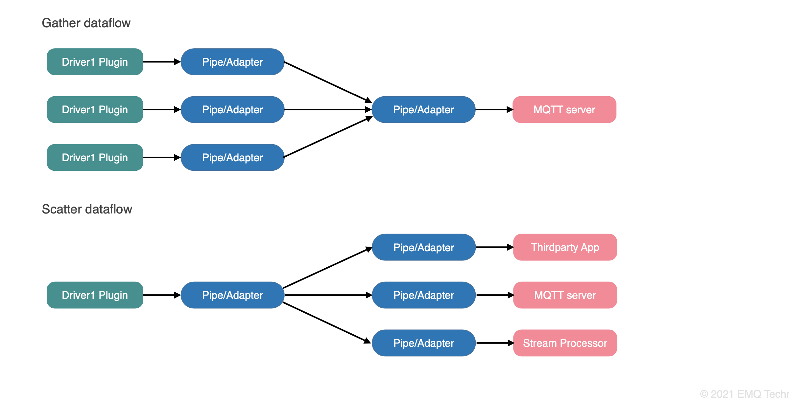

# Neuron

[](https://github.com/neugates/neuron/releases)
[](https://slack-invite.emqx.io/)
[](https://discord.gg/xYGf3fQnES)
[](https://twitter.com/EMQTech)
[](https://www.youtube.com/channel/UC5FjR77ErAxvZENEWzQaO5Q)

English | [简体中文](https://github.com/neugates/neuron/blob/main/README-CN.md)

Neuron is an Industrial IoT (IIoT) edge industrial gateway for modern big data technology to leverage the power of Industrial 4.0. It supports one-stop access to dozens of industrial protocols and converts them into MQTT protocol to access the IIoT platform.

Version 2.0 streamlines some of the non-essential features in version 1.x and focuses on the data collection and forwarding of industrial protocols in order to provide more efficient and flexible one-stop protocol access and management for the IIoT platform.

## Goals and Features

Neuron is designed to focus on data collection, forwarding, and aggregation for the IIoT - converting data from a wide variety of industrial devices with different protocol types into a unified standard MQTT message to interconnect these individual devices and better integrate them into the larger IoT system for direct remote control and information access.

We hope that Neuron can run on both low-end embedded Linux devices and Linux workstations with larger memory to support large numbers of connected devices and large amounts of data points. Neuron is therefore designed to have a very little memory footprint and a very low CPU footprint while being scalable to meet the needs of different operating resources.

The following is some important features of Neuron:

- Plugged-in southbound driver and northbound application.
- A light-weigh built-in web server. The user can configure, control and monitor device through browser.
- A replaceable MQTT Client. The user can control and read/write device by MQTT message.
- Support simultaneous connection of a large number of devices with different protocols.
- Highly integrated with other EMQ products, including EMQ X, NanoMQ, eKuiper(Initiated by EMQ and now maintained and operated by LF Edge).
- Support updating device drivers during Neuron runtime.

For a full list of new features, please read [Instructions for application and driver](https://neugates.io/plugins)。

For more information, please visit [Homepage](https://neugates.io)。

## Architecture design

Most modern CPUs are already multi-core, even the lower-end ARM and Risc-V architecture CPUs used in embedded systems, most of which have multi-core chips. Therefore, we need to be able to make full use of these multi-core CPUs, that is, Neuron needs to have very good multi-core and multi-thread performance. We use library NNG, which is an asynchronous concurrent library for multi-threaded IO processing and message passing, which can make full use of the multiple cores of the CPU.

We use the star bus mode as an organizational form, and there is a message routing center. This message routing is based on NNG to provide high-efficiency message forwarding. The sending and receiving of messages is communication between threads. By using shared buffers and smart pointers, there is no memory copy, which is very efficient. Around this routing center are nodes, every node includes an adapter and plugin. These nodes can be built-in with Neuron, such as a lightweight web server, or they can be dynamically added, such as various device drivers, MQTT clients, eKuiper interface, and so on. By this design, it isolates the coupling between each device driver and northbound application. In addition, the subscription-publishing mechanism is used to realize the scattering and gathering of data streams, which makes Neuron extremely flexible. Users can dynamically increase and decrease device-driven nodes according to the working load of the site, with good configurability. In addition, when the hardware CPU running Neuron has good performance, more cores, and large memory, Neuron can support more device driver nodes, massive data points, greater data throughput, and lower response time. Has good system scalability.

Neuron uses a plugged-in mechanism to support changing user functional requirements. Users can dynamically load plug-ins with different functions according to the functional requirements of the application scenario. When the device driver has a bug fix and needs to be upgraded, you can also dynamically update the new plug-in to solve the problem and get the new feature. The running state of each node is independent. When the plug-in of one node is upgraded, it will not affect the running state of other nodes, and Neuron does not need to be restarted.

An overview of Neuron's architecture is shown in the figure below:


The topology of bus in Neuron and the scattering/gathering of data flow are shown in the figure below:




The hierarchical layer diagram of Neuron is shown in the figure below:


## Installation

###  Install dependent libraries

[Source code to install dependent libraries](https://github.com/neugates/neuron/blob/main/Install-dependent-libraries.md)

## Build

```shell
# build
cd neuron && mkdir build 
cd build
cmake .. && make
cd -
```

## Quick Start

```shell
# Start neuron
cd build
./neuron
cd -
```

## Test

To run all unit testers

```shell
cd build
ctest --output-on-failure
cd -
```

## Functional test

To run all functional testers

```shell
mosquitto -v &
pip3 install -r ft/requirements.txt
python3 -m robot -P ft/ --variable neuron_api:http -d ft/http_reports ft

```

## Pressure test

There are datasets for pressure testing in directory `ft/data/persistence/`.

To run pressure tests

```shell
# python dependencies
pip3 install -r ft/requirements.txt

# through http api, on dataset total-10k
python3 -m robot -P ft/ --variable neuron_api:http --variable dataset:total-10k -d ft/http-total-10k ft/pressure.test
# through http api, on dataset total-50k
python3 -m robot -P ft/ --variable neuron_api:http --variable dataset:total-50k -d ft/http-total-50k ft/pressure.test

# A MQTT broker is needed if using the mqtt api, mosquitto in this example
mosquitto -v &

# through mqtt api, on dataset simple-1k
python3 -m robot -P ft/ --variable neuron_api:mqtt --variable dataset:simple-1k -d ft/mqtt-simple-1k ft/pressure.test

```

## Community

You can connect with the Neuron community and developers in the following ways.

- Discussions：https://github.com/neugates/neuron/discussions
- Slack：https://slack-invite.emqx.io/
- Discord：https://discord.gg/xYGf3fQnES 
